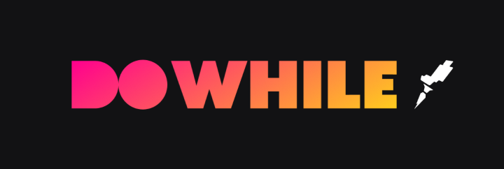
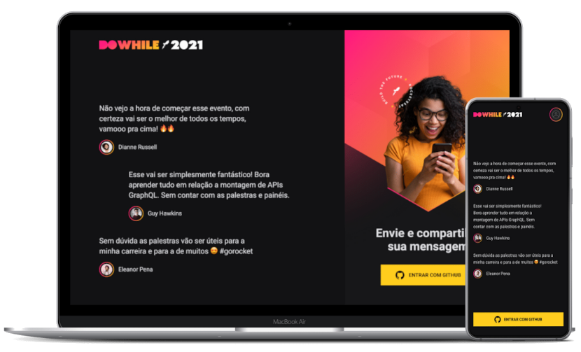

<h1 align="center">
  
</h1>

<p align="center">
  <a href="#-tecnologias">Tecnologias</a>&nbsp;&nbsp;&nbsp;|&nbsp;&nbsp;&nbsp;
  <a href="#-projeto">Projeto</a>&nbsp;&nbsp;&nbsp;|&nbsp;&nbsp;&nbsp;
  <a href="#-layout">Layout</a>&nbsp;&nbsp;&nbsp;|&nbsp;&nbsp;&nbsp;
  <a href="#-como-executar">Como executar</a>&nbsp;&nbsp;&nbsp;|&nbsp;&nbsp;&nbsp;
  <a href="#-licença">Licença</a>
</p>

<br>

<p align="center">
  
</p>

## ✨ Tecnologias

Esse projeto foi desenvolvido com as seguintes tecnologias:

- [React Native](https://reactnative.dev/)
- [Typescript](https://www.typescriptlang.org/)
- [CSS](https://developer.mozilla.org/pt-BR/docs/Web/CSS)
- [AsyncStorage](https://react-native-async-storage.github.io/async-storage/)
- [Expo](https://expo.dev/)
- [OAuth Github](https://docs.github.com/pt/developers/apps/building-oauth-apps/authorizing-oauth-apps)

## 💻 Projeto

Este projeto foi desenvolvido durante o evento **NLW Heat** para utilização como mural de mensagens do Do While 2021.

Projeto Mobile desenvolvido utilizando a tecnologia React Native. Ao acessar a aplicação, é possível visualizar o mural de mensagens juntamente com a autenticação com o Github. 

Realizando a autenticação, o botão de autenticação é alterado para um botão de envio de mensagens que, clicando o teclado deve aparecer para que seja possível redigir e enviar a mensagem. A cada nova mensagem, é recarregado o mural para que sejam mostradas apenas as últimas 3 mensagens.

Este repositório faz parte da seguinte stack:

- [Backend - Node.js](https://github.com/AndreNavarro/NLW07-DoWhile-Node)
- [Front end - React.js](https://github.com/AndreNavarro/NLW07-DoWhile-React)
- [Mobile - React Native](https://github.com/AndreNavarro/NLW07-DoWhile-React-Native) 👈 Você está aqui
- [Backend - Elixir](https://github.com/AndreNavarro/NLW07-DoWhile-Elixir)

## 🔖 Layout

Você pode visualizar o layout do projeto através [desse link](https://www.figma.com/file/GaOSAvvH1R6edFXSpBJmd3/%5BNLW-Heat---Mission%3A-Impulse%5D-DoWhile2021-(Community)?node-id=2%3A3). É necessário ter conta no [Figma](https://figma.com) para acessá-lo.

## 🚀 Como Executar

- Clone este repositório
- Execute ```expo start``` e com seu emulador ou smartphone com app do Expo instalado, acesse via QR Code a aplicação.

## 📝 Licença

Projeto desenvolvido pela Rocketseat e apresentado na **Next Level Week - Heat** (nlw #07).